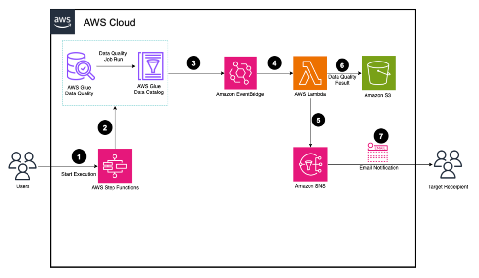
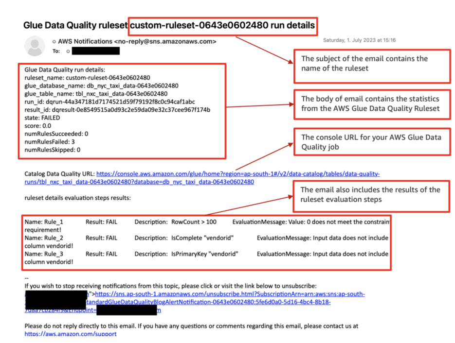

# aws-glue-data-quality-customise-email-notification

Alerts and notifications play a crucial role in maintaining data quality because they facilitate prompt and efficient responses to any data quality issues that may arise within a dataset. By establishing and configuring alerts and notifications, you can actively monitor data quality and receive timely alerts when data quality issues are identified. This proactive approach helps mitigate the risk of making decisions based on inaccurate information. Furthermore, it allows for necessary actions to be taken, such as rectifying errors in the data source, refining data transformation processes, and updating data quality rules.

## Getting started

This document is designed to be used with the AWS Big Data Blog titled "Set up alerts and orchestrate data quality rules with AWS Glue Data Quality" and comprises of scripts, templates used to run AWS Glue Data Quality Alert and Notification.

## Expected Input and Output

This code uses an input dataset "yellow_tripdata_2022-01". The CloudFormation template can be launched in any AWS regions and it creates different AWS services example - AWS Step Functions, EventBridge Rule, Lambda Function, Glue Data Quality Ruleset, S3 buckets and SNS topic.

Please follow the blog  "https://aws.amazon.com/blogs/big-data/set-up-alerts-and-orchestrate-data-quality-rules-with-aws-glue-data-quality/" to launch the Glue data quality alert and notification successfully.

The following sample email provides operational metrics for the AWS Glue Data Quality ruleset evaluation. It provides details about the ruleset name, the number of rules passed or failed, and the score. This helps you visualize the results of each rule along with the evaluation message if a rule fails.

## Security

See [CONTRIBUTING](CONTRIBUTING.md#security-issue-notifications) for more information.

## License

This library is licensed under the MIT-0 License. See the LICENSE file.

